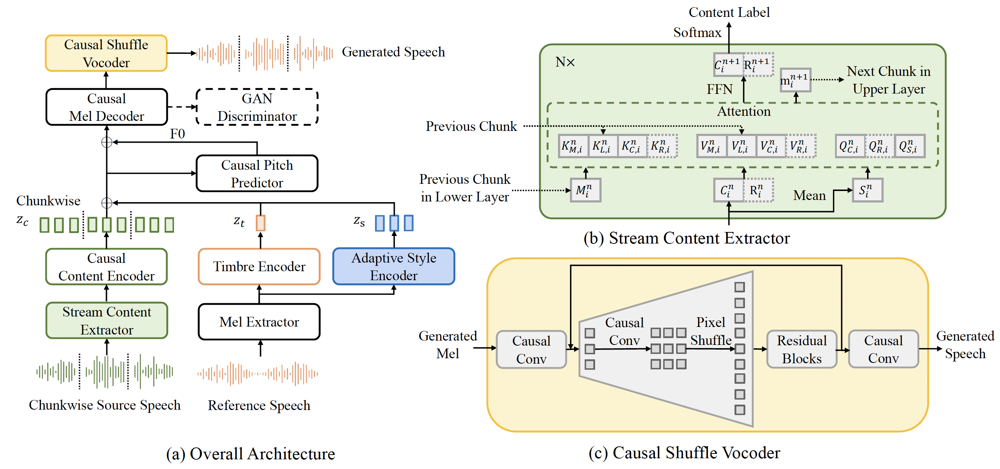
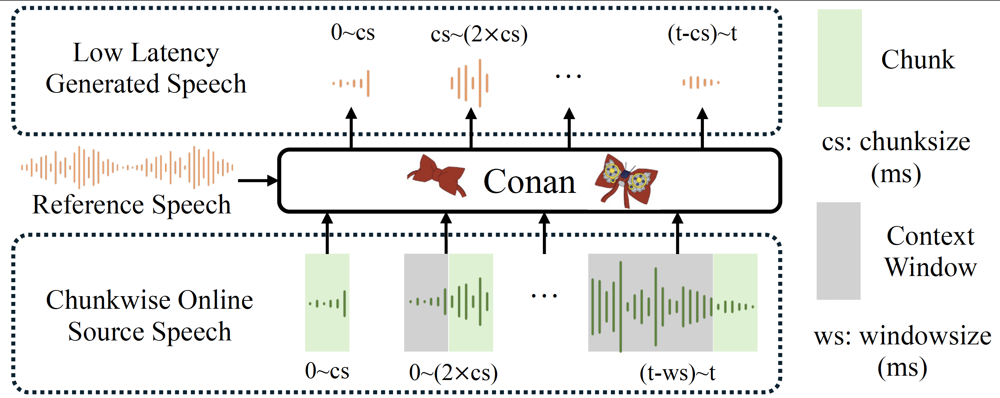

# Conan: Streaming Voice Conversion with Diffusion Models

[](https://www.python.org/downloads/release/python-380/)
[](https://pytorch.org/)
[](LICENSE)


Zero-shot online voice conversion (VC) holds significant promise for real-time communications and entertainment. 
However, current VC models struggle to preserve semantic fidelity under real-time constraints, deliver natural-sounding conversions, and adapt effectively to unseen speaker characteristics.
To address these challenges, we introduce Conan, a chunkwise online zero-shot voice conversion model that preserves the content of the source while matching the speaker representation of reference speech.
Conan comprises three core components: 
1) A Stream Content Extractor that leverages Emformer for low-latency streaming content encoding; 
2) An Adaptive Style Encoder that extracts fine-grained stylistic features from reference speech for enhanced style adaptation; 
3) A Causal Shuffle Vocoder that implements a fully causal HiFiGAN using a pixel-shuffle mechanism. 
Experimental evaluations demonstrate that Conan outperforms baseline models in subjective and objective metrics.

## 🌟 Features

- **Streaming Voice Conversion**: Real-time voice conversion with low latency (~80ms)
- **Emformer Integration**: Efficient transformer-based content encoding
- **High-Quality Vocoding**: Pixel-shuffle  causal HiFi-GAN vocoder for natural-sounding audio output

## Workflow
Our workflow (inference procedure) is shown in the following figure.

we first feed the entire reference speech into the model to provide timbre
and stylistic information. During chunkwise online inference,
we wait until the input reaches a predefined chunk size before
passing it to the model. Because our generation speed for each
chunk is faster than the chunk’s duration, online generation
becomes possible. To ensure temporal continuity, we employ
a sliding context window strategy. At each generation step,
we not only input the source speech of the current chunk but
also include the preceding context. From the model’s output,
we extract only the segment for this chunk. As the context
covers the receptive field, consistent overlapping segments can
be generated, ensuring smooth transitions at chunk boundaries.

## 📋 Requirements

### System Requirements
- Python 3.10+

## 🚀 Installation

1. **Clone the repository**:
```bash
git clone https://github.com/User-tian/Conan.git
cd Conan
```

2. **Create a virtual environment**:
```bash
python -m venv conan_env
source conan_env/bin/activate  # On Windows: conan_env\Scripts\activate
```

3. **Install dependencies**:
```bash
pip install torch torchaudio --index-url https://download.pytorch.org/whl/cu118
pip install -r requirements.txt
```

4. **Install the package**:
```bash
pip install -e .
```

## 📊 Data Preparation

### Dataset Structure
Prepare your dataset in the following structure:
```
data/
├── raw/
│   ├── speaker1/
│   │   ├── audio1.wav
│   │   ├── audio2.wav
│   │   └── ...
│   ├── speaker2/
│   │   └── ...
│   └── ...
├── processed/
│   ├── metadata.json
│   └── ...
└── binary/
    └── vc/
        ├── train.bin
        ├── valid.bin
        └── ...
```

### Metadata Format
The `metadata.json` file should contain entries like:
```json
[
  {
    "item_name": "speaker1_audio1",
    "txt": "Hello world",
    "wav_fn": "data/raw/speaker1/audio1.wav",
    "spk_id": 0,
    "f0_fn": "data/raw/speaker1/audio1.f0",
    "hubert_fn": "data/processed/speaker1/audio1.hubert"
  }
]
```

### Data Preprocessing Steps

1. **Extract F0 features using RMVPE**:
```bash
export PYTHONPATH=/storage/baotong/workspace/Conan:$PYTHONPATH
python trials/extract_f0_rmvpe.py \
    --input_dir /path/to/audio/files \
    --output_dir /path/to/f0/output
```

2. **Extract HuBERT features**:
```bash
python trials/extract_hubert_features.py \
    --input_dir /path/to/audio/files \
    --output_dir /path/to/hubert/output
```

3. **Binarize the data**:
```bash
python data_gen/tts/runs/binarize.py --config egs/emformer.yaml
```

### Configuration
Update the configuration files in `egs/` directory to match your dataset:
- `egs/stage1.yaml`: Main training configuration
- `egs/emformer.yaml`: Emformer training configuration
- `egs/hifinsf_16k320_shuffle.yaml`: Vocoder training configuration

Key parameters to adjust:
```yaml
# Dataset paths
binary_data_dir: 'data/binary/vc'
processed_data_dir: 'data/processed/vc'

# Audio parameters
audio_sample_rate: 16000
hop_size: 320
win_size: 1024

# Speaker settings
num_spk: 120  # Number of speakers in your dataset
use_spk_id: true
```

## 🎯 Training

### Stage 1: Train Emformer
```bash
CUDA_VISIBLE_DEVICES=0 python tasks/run.py \
    --config egs/emformer.yaml \
    --exp_name emformer_training \
    --reset
```

### Stage 2: Train Main Conan Model
```bash
CUDA_VISIBLE_DEVICES=0 python tasks/run.py \
    --config egs/stage1_emformer.yaml \
    --exp_name conan_training \
    --reset
```

### Stage 3: Train HiFi-GAN Vocoder
```bash
CUDA_VISIBLE_DEVICES=1 python tasks/run.py \
    --config egs/hifinsf_16k320_shuffle.yaml \
    --exp_name hifigan_training \
    --reset
```

### Training Monitoring
Monitor training progress using TensorBoard:
```bash
tensorboard --logdir checkpoints/
```

## 🔮 Inference

### Basic Voice Conversion
```bash
CUDA_VISIBLE_DEVICES=0 python inference/Conan.py \
    --config egs/stage1_emformer.yaml \
    --exp_name checkpoints/conan_mainmodeltest
```

### Batch Voice Conversion
```bash
CUDA_VISIBLE_DEVICES=0 python inference/run_voice_conversion.py \
    --config egs/stage1_previousemformer.yaml \
    --exp_name stage1_clean
```

### Streaming Voice Conversion
For real-time streaming voice conversion, use the `StreamingVoiceConversion` class:
```python
from inference.Conan import StreamingVoiceConversion
from utils.commons.hparams import set_hparams

# Load configuration
set_hparams("egs/stage1_emformer.yaml")

# Initialize the streaming converter
converter = StreamingVoiceConversion(hparams)

# Convert audio in real-time
output_audio = converter.convert_streaming(
    source_audio="path/to/source.wav",
    target_speaker_id=1
)
```

## 📁 Project Structure

```
Conan/
├── modules/                    # Core model implementations
│   ├── Conan/                 # Main Conan model
│   ├── Emformer/              # Emformer feature extractor
│   ├── vocoder/               # HiFi-GAN vocoder
│   └── ...
├── tasks/                     # Training and evaluation tasks
│   ├── Conan/                 # Conan training task
│   └── ...
├── inference/                 # Inference scripts
│   ├── Conan.py              # Main inference script
│   ├── run_voice_conversion.py
│   └── ...
├── data_gen/                  # Data preprocessing
│   ├── conan_binarizer.py    # Data binarization
│   └── ...
├── egs/                       # Configuration files
│   ├── stage1.yaml           # Main training config
│   ├── emformer.yaml         # Emformer config
│   └── ...
├── utils/                     # Utility functions
└── checkpoints/              # Model checkpoints
```

## ⚙️ Configuration

### Key Configuration Parameters

#### Audio Processing
```yaml
audio_sample_rate: 16000    # Audio sample rate
hop_size: 320              # Hop length for STFT
win_size: 1024             # Window size for STFT
max_frames: 3000           # Maximum frames per sample
```

#### Model Architecture
```yaml
hidden_size: 256           # Hidden dimension
kernel_size: 3             # Convolution kernel size
residual_layers: 20        # Number of residual layers
residual_channels: 256     # Residual channels
```

#### Training
```yaml
max_updates: 200000        # Maximum training steps
val_check_interval: 5000   # Validation interval
learning_rate: 0.0001      # Learning rate
batch_size: 32             # Batch size
```

## 📈 Performance

The Conan system achieves state-of-the-art performance on voice conversion tasks:

- **Latency**: ~80ms streaming latency
- **Quality**: High-quality voice conversion with natural prosody
- **Scalability**: Support for 120+ speakers
- **Robustness**: Robust to different speaking styles and content

## 🤝 Contributing

We welcome contributions! Please follow these steps:

1. Fork the repository
2. Create a feature branch (`git checkout -b feature/amazing-feature`)
3. Commit your changes (`git commit -m 'Add amazing feature'`)
4. Push to the branch (`git push origin feature/amazing-feature`)
5. Open a Pull Request

## 📄 Citation

If you use Conan in your research, please cite our work:

```bibtex
@article{conan2024,
  title={Conan: Streaming Voice Conversion with Diffusion Models},
  author={Your Name and Collaborators},
  journal={arXiv preprint arXiv:2024.xxxxx},
  year={2024}
}
```

## 📜 License

This project is licensed under the MIT License - see the [LICENSE](LICENSE) file for details.

## 🙏 Acknowledgments

- [FastSpeech2](https://github.com/ming024/FastSpeech2) for the base TTS architecture
- [HiFi-GAN](https://github.com/jik876/hifi-gan) for the neural vocoder
- [Emformer](https://github.com/pytorch/audio) for efficient transformer implementation
- [VCTK](https://datasets.activeloop.ai/docs/ml/datasets/vctk/) dataset for training data

## 📞 Contact

For questions and support:
- Create an issue on GitHub
- Email: [your-email@domain.com]
- Project page: [https://your-project-page.com]

---

**Note**: This is a research implementation. For production use, additional optimization and testing may be required.
